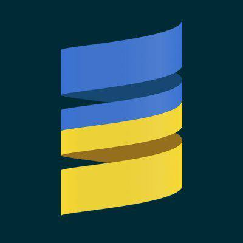

  
  <h1>Scala Ukraine Knowledge Base</h1>
  
  

    The Knowledge Base Of Scala Ukraine Telegram Channel 
  

  
<!-- Badges -->

  
  
  
  
  

   
<h4>
    <a href="https://github.com/Louis3797/VladKopanev/scala-ukraine-knowledge-base">Documentation</a>
   · 
    <a href="https://github.com/VladKopanev/scala-ukraine-knowledge-base/issues/">Report Bug</a>
   · 
    <a href="https://github.com/VladKopanev/scala-ukraine-knowledge-base/issues/">Request Feature</a>
  </h4>

 

<!-- Table of Contents -->
# :closed_book: Table of Contents

- [Корисні Посилання](#star2-корисні-посилання)
  * [Книжки](#books-книжки)
  * [Курси](#dart-курси)
  * [Блоги](#art-блоги)
  * [Спільноти](#family-спільноти)
  * [Інше](#hammer_and_wrench-інше)
- [Статут](#scroll-статут)
- [Як допомогти](#wave-як-допомогти)
- [Контакти](#handshake-контакти)
- [Подяки](#gem-подяки)
  

<!-- Корисні Посилання -->
## :star2: Корисні Посилання

<!-- TechStack -->
### :books: Книжки

  
На загальні теми

  <ul>
    <li><a href="https://www.artima.com/shop/programming_in_scala_5ed">Programming in Scala, Fifth Edition</a></li>
    <li><a href="https://www.manning.com/books/get-programming-with-scala">Get Programming with Scala</a></li>
    <li><a href="https://www.oreilly.com/library/view/programming-scala-3rd/9781492077886/">Programming Scala, 3rd Edition</a></li>
    <li><a href="https://books.google.com.ua/books/about/%D0%9A%D0%BE%D0%BD%D0%BA%D1%83%D1%80%D0%B5%D0%BD%D1%82%D0%BD%D0%BE%D0%B5_%D0%BF%D1%80%D0%BE%D0%B3%D1%80%D0%B0%D0%BC.html?id=rsJSEAAAQBAJ&redir_esc=y">Конкурентное программирование на Scala. Автор: Александр Прокопец</a></li>
    <li><a href="https://www.handsonscala.com/">Hands-on Scala Programming by Li Haoyi</a></li>
  </ul>

  
Функціональне Програмування

  <ul>
    <li><a href="https://www.manning.com/books/functional-programming-in-scala">Functional Programming in Scala</a></li>
    <li><a href="https://leanpub.com/pfp-scala">Practical FP in Scala by Gabriel Volpe</a></li>
    <li><a href="https://underscore.io/books/scala-with-cats/">Scala with Cats by Underscore.io</a></li>
    <li><a href="https://www.zionomicon.com/">Zionomicon by John De Goes</a></li>
  </ul>

  
Big Data

  <ul>
    <li><a href="https://www.amazon.com/Scala-Programming-Big-Data-Analytics/dp/1484248090">Scala Programming for Big Data Analytics: Get Started With Big Data Analytics Using Apache Spark</a></li>
    <li><a href="https://www.amazon.com/Scala-Spark-Big-Data-Analytics/dp/1785280848">Scala and Spark for Big Data Analytics: Explore the concepts of functional programming, data streaming, and machine learning</a></li>
  </ul>
  

Інше

  <ul>
    <li><a href="https://www.oreilly.com/library/view/designing-data-intensive-applications/9781491903063/">Designing Data-Intensive Applications</a></li>
  </ul>

<!-- Courses -->
### :dart: Курси

<ul>
    <li><a href="https://rockthejvm.com">Rock The JVM</a></li>
    <li><a href="https://www.coursera.org/learn/effective-scala">Effective Programming in Scala by EPFL</a></li>
    <li><a href="https://www.coursera.org/specializations/scala">Functional Programming in Scala Specialization by M. Odersky</a></li>
</ul>

<!-- Youtube -->
### :film_projector: Відео
<ul>
  <li><a href="https://www.youtube.com/playlist?list=PLLMXbkbDbVt8tBiGc1y69BZdG8at1D7ZF">Play Framework using Scala by Mark Lewis</a></li>
  <li><a href="https://www.youtube.com/c/FunctionalJustin">Functional Justin</a></li>
  <li><a href="https://www.youtube.com/channel/UCIH0OgqE54-KEvYDg4LRhKQ">Scala 3 Compiler Academy</a></li>
  <li><a href="https://www.youtube.com/channel/UCxB_9AWzBvp4mWSk8zpFU6g/featured">CSE 116. CS in Scala</a></li>
  <li><a href="https://www.youtube.com/channel/UCBSRCuGz9laxVv0rAnn2O9Q/featured">Jakub Kozłowski</a></li>
  <li><a href="https://www.youtube.com/c/DevInsideYou">DevInsideYou by Vlad</a></li>
</ul>

<!-- Blogs -->
### :art: Блоги та інш.
<ul>
    <li><a href="https://softwaremill.com/blog/">Softwaremill</a></li>
    <li><a href="https://twitter.github.io/effectivescala/">Effective Scala by Twitter</a></li>
    <li><a href="http://aperiodic.net/phil/scala/s-99/">I've got 99 problems but Scala ain't one :)</a></li>
    <li><a href="https://www.scala-exercises.org/">Scala Exercises</a></li>
</ul>

<!-- Communities -->
### :family: Спільноти
<ul>
    <li><a href="https://t.me/scala_ukraine">Scala Ukraine</a></li>
</ul>

<!-- Other -->
## :hammer_and_wrench: Інше

<!-- Code of Conduct -->
## :scroll: Статут

Будь ласка, прочитайте статут нашої спільноти, який знаходиться за наступним [посиланням](./CODE_OF_CONDUCT.md)

<!-- Contributing -->
## :wave: Як Допомогти

Переходьте до `contributing.md` для інформації про те як зробити свій внесок в цей репозиторій.

Також долучайтесь до нашої спільноти в [телеграм](https://t.me/scala_ukraine)!
<!-- Contact -->
## :handshake: Контакти

Kopaniev Vladyslav - [@vendigor](https://t.me/vendigor) - ivengo53@gmail.com

Наш Телеграм Канал: [https://t.me/scala_ukraine](https://t.me/scala_ukraine)

<!-- Acknowledgments -->
## :gem: Подяки

 - [Shields.io](https://shields.io/)
 - [Awesome README](https://github.com/matiassingers/awesome-readme)
 - [Emoji Cheat Sheet](https://github.com/ikatyang/emoji-cheat-sheet/blob/master/README.md#travel--places)
 - [Readme Template](https://github.com/othneildrew/Best-README-Template)

